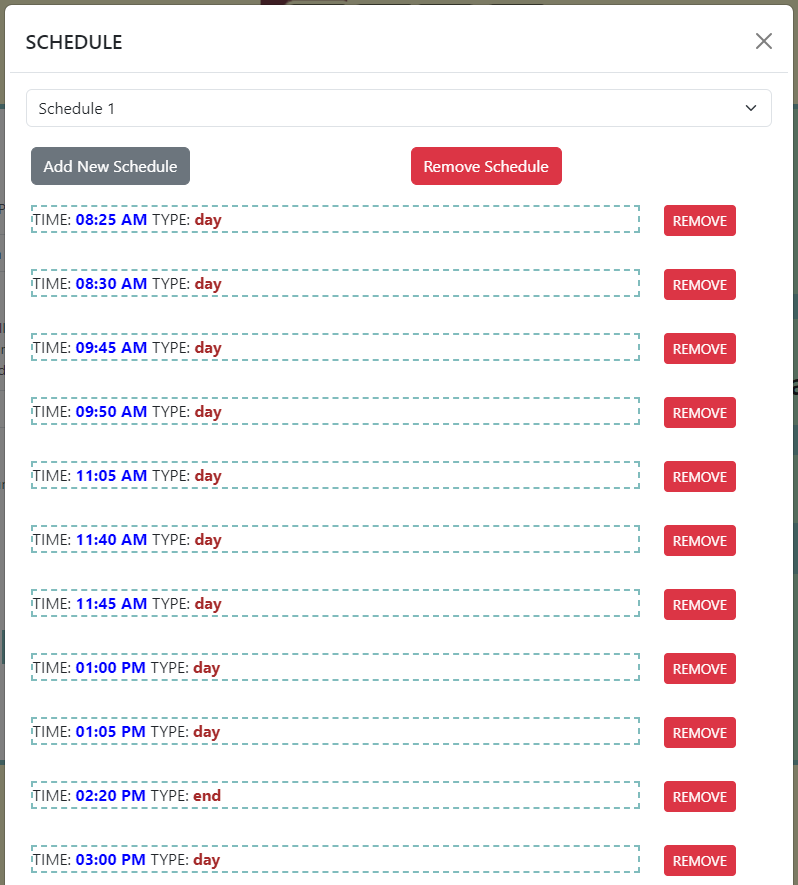

# Simple School Bell System (SSBS)

## Introduction

This project is designed to automate the school bell system using a Raspberry Pi. It includes a Flask web application for controlling the bell schedule and managing bell songs. The system allows users to connect to the Raspberry Pi, run the school bell script, and control the user interface through a web browser.

## Interface

1. Begin by typing in the IP address of the Raspberry Pi.  It should look like `X.X.X.X:8080`. Replace the `X` with the appropriate numbers which can be found by referring to the [Control User Interface](#control-user-interface) section.

   


2. You can now access the application. Uploading an .mp3, setting a time-stamp for clipping, start/stop/test, and volume are all self explanatory.

   


3. Clicking the `SCHEDULE` button will trigger a pop-up that will let you add and remove new time slots.  Clicking the dropdown will let you load a different schedule.  Here you can add a new schedule or delete the currently selected schedule.  The main page will let you know which Schedule is currently loaded.

   

## Getting Started

### Connect to Raspberry Pi
1. Ensure that your Raspberry Pi is powered on.
2. This guide assumes you have the following setup on your device:
 - Raspberry Pi compatible Linux distribution
 - Wi-Fi / Ethernet Adapter
 - Audio Output

#### Windows (using Cygwin):
1. Open Cygwin or any other Unix CLI Emulator.
2. Enter the following command:
   ```
   ssh admin@raspberrypi.local
   ```
3. If prompted, enter your password.

#### Mac / Linux:
1. Open the terminal from the Applications menu.
2. Enter the following command:
   ```
   ssh admin@raspberrypi.local
   ```
3. If prompted, enter your password.

### Transfer or Download Files

1. Download and extract all the files onto your Raspberry Pi.

2. You may need to transfer files over to the Raspberry Pi.  If so you can download the files as a zip.  Then you can transfer them like so:
    ```
    scp path/to/file admin@raspberrypi.local:/path/to/destination
    ```
**Note**
You can replace "admin" with whatever the account is that is running the script on the Raspberry Pi.

### Run School Bell Script

1. Change the directory to the app:
   ```
   cd /path/to/your/SchoolBell/
   ```

2. Start the virtual environment. Enter:
   ```
   . .venv/bin/activate
   
   ```
3. Install Flask and all of the dependancies in `recquirements.txt`:
   ```
   pip install -r requirements.txt
   ```

4. Run the script:
   ```
   python main.py
   ```

### Control User Interface

1. Find the IP address of your Raspberry Pi on the local network. You can do this by running the following command on the Raspberry Pi:
   ```
   hostname -I
   ```
   Note the IP address provided.

2. Open any browser on the same network.

3. Enter the following URL in the browser's address bar, replacing `<Raspberry_Pi_IP>` with the actual IP address obtained in step 1:
   ```
   http://<Raspberry_Pi_IP>:8080
   ```

### Uploading a Bell Song

1. Click the "Stop" button.

2. Select whether to replace the DAY or END bell.

3. Specify the 45 second segment you want to upload.

4. Click the "Upload" button.

5. Click the "Start" button.

6. Wait for the process to complete.

**Note**
Ensure that you click stop before you make any changes.  The upload process might cause an error if the program is not stopped before uploading the song.

## Stopping the Process

If needed, you can stop the process by following these steps:

1. Check if the process is running:
   ```
   jobs
   ```

2. Stop the process (replace `%1` with the job number):
   ```
   kill %1
   ```

## Run on Boot

To ensure that the School Bell Management System runs automatically on boot, follow these steps:

1. Open the terminal on your Raspberry Pi.

2. Navigate to the directory where your School Bell System is located. For example:

    ```
    cd /path/to/your/SchoolBell
    ```

3. Create a new service file for systemd. You can use a text editor like `nano` or `vim`. For example:

    ```
    nano schoolbell.service
    ```

4. Copy and paste the following content into the service file:

    ```ini
    [Unit]
    Description=School Bell Managment System
    After=network-online.target

    [Service]
    ExecStartPre=/bin/bash -c 'source /path/to/your/SchoolBell/.venv/bin/activate'
    ExecStart=/usr/bin/python3 /path/to/your/SchoolBell/main.py
    WorkingDirectory=/path/to/your/SchoolBell
    Restart=always
    User=admin
    Environment=DISPLAY=:0
    Environment=PULSE_SERVER=unix:/run/user/1000/pulse/native
    Environment=PULSE_COOKIE=/home/admin/.config/pulse/cookie

    [Install]
    WantedBy=multi-user.target
    ```

   **Note**
   Make sure to replace `/path/to/your/SchoolBell` with the actual path to your School Bell System and `User=` with the account running the service.  
   You also may have to manually set the host address in the `main.py` file to ensure that the program is served correctly.
    
    ```
    if __name__ == "__main__":
       app.run(host='X.X.X.X', port=8080)
    ```

    Just replace `X.X.X.X` with the address you want the app to service. Most probably it will be the local address of the Raspberry Pi.

5. Save the file and exit the text editor.

6. Move the service file to the systemd directory:

    ```
    sudo mv schoolbell.service /etc/systemd/system/
    ```

7. Reload the systemd manager configuration:

    ```
    sudo systemctl daemon-reload
    ```

8. Enable the service to start on boot:

    ```
    sudo systemctl enable schoolbell.service
    ```

9. Reboot your Raspberry Pi:

    ```
    sudo reboot
    ```

10. If you make any changes to the code and you want to make sure the service is running correctly, make sure to type this:

    ```
    sudo systemctl daemon-reload
    sudo systemctl restart schoolbell.service
    ```

11. You can check the status of the service with this:

    ```
    sudo systemctl status schoolbell.service
    ```

Now, the School Bell Management System should automatically start on boot.


## Future Updates

1. Connect to an audio-clip api to facilitate song selection.  As of now you have to find and upload your own ".mp3" files.

2. QOL
